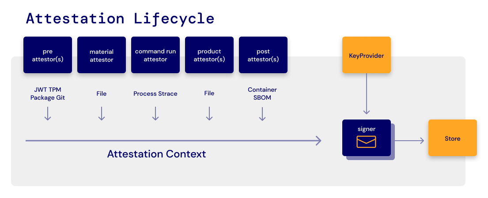
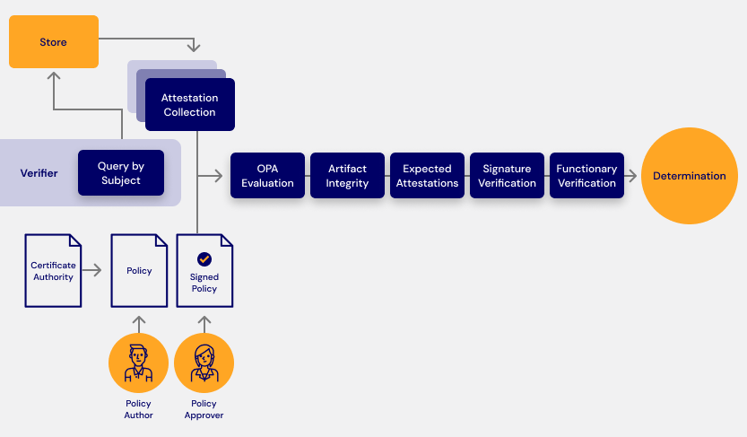

<p align="center">
  
</p>

[](https://asciinema.org/a/2DZRRh8uzrzHcUVL8md86Zj4D)

[](https://api.securityscorecards.dev/projects/github.com/testifysec/witness)

## Witness is a pluggable framework for supply chain security

Witness prevents tampering of build materials and verifies the integrity of the build process from source to target. It works by wrapping commands executed in a continuous integration process. Its attestation system is pluggable and offers support out of the box for most major CI and infrastructure providers. Verification of Witness metadata and a secure PKI distribution system will mitigate against many software supply chain attack vectors and can be used as a framework for automated governance.

Witness is an implementation of the in-toto spec including [ITE-5](https://github.com/in-toto/ITE/tree/master/ITE/5), [ITE-6](https://github.com/in-toto/ITE/tree/master/ITE/6), [ITE-7](https://github.com/in-toto/ITE/tree/master/ITE/7) with an [embedded rego policy engine](https://www.openpolicyagent.org/docs/latest/integration/#integrating-with-the-go-api).

- Does **NOT** require elevated privileges.
- Can run in a containerized or non-containerized environment
- Records secure hashes of materials, artifacts, and events occurring during the CI process
- Integrations with cloud identity services
- Keyless signing with [SPIFFE/SPIRE](https://spiffe.io/)
- Support for uploading attestation evidence to rekor server (sigstore)
- Build policy enforcement with Open Policy Agent.
- Alpha support for tracing and process tampering prevention
- Verifies file integrity between CI steps, and across air gap.
- Experimental Windows and ARM Support
- Capable of using [Archivist](https://github.com/testifysec/archivist) as an attestation store

## Usage

- [Run](docs/witness_run.md) - Runs the provided command and records attestations about the execution.
- [Sign](docs/witness_sign.md) - Signs the provided file with the provided key.
- [Verify](docs/witness_verify.md) - Verifies a witness policy.

## TOC

- [Witness Attestors](#witness-attestors)
  - [What is a witness attestor?](#what-is-a-witness-attestor)
  - [Attestor Security Model](#attestor-security-model)
  - [Attestor Life Cycle](#attestor-life-cycle)
    - [Attestation Lifecycle](#attestation-lifecycle)
  - [Attestor Types](#attestor-types)
    - [Pre Run Attestors](#pre-run-attestors)
    - [Internal Attestors](#internal-attestors)
    - [Post Run Attestors](#post-run-attestors)
    - [AttestationCollection](#attestationcollection)
    - [Attestor Subjects](#attestor-subjects)
  - [Witness Policy](#witness-policy)
    - [What is a witness policy?](#what-is-a-witness-policy)
  - [Witness Verification](#witness-verification)
    - [Verification Lifecycle](#verification-lifecycle)
  - [Using SPIRE for Keyless Signing](#using-spire-for-keyless-signing)
  - [Witness Examples](#witness-examples)
  - [Media](#media)
  - [Roadmap](#roadmap)
  - [Support](#support)

## Getting Started

### Download the Binary
[Releases](https://github.com/testifysec/witness/releases)
```
curl -LO https://github.com/testifysec/witness/releases/download/${VERSION}/witness_${VERSION}_${ARCH}.tar.gz
tar -xzf witness_${VERSION}_${ARCH}.tar.gz
```

### Create a Keypair

> Witness supports keyless signing with [SPIRE](https://spiffe.io/)!

```
openssl genpkey -algorithm ed25519 -outform PEM -out testkey.pem
openssl pkey -in testkey.pem -pubout > testpub.pem
```

### Create a Witness configuration

> - This file generally resides in your source code repository along with the public keys generated above.
> - `.witness yaml` is the default location for the configuration file
> - `witness help` will show all configuration options
> - command-line arguments overrides configuration file values.

```
## .witness.yaml

run:
    key: testkey.pem
    trace: false
verify:
    attestations:
        - "test-att.json"
    policy: policy-signed.json
    publickey: testpub.pem
```

### Record attestations for a build step

> - The `-a {attestor}` flag allows you to define which attestors run
> - ex. `-a maven -a gcp -a gitlab` would be used for a maven build running on a GitLab runner on GCP.
> - Defining step names is important, these will be used in the policy.
> - This should happen as a part of a CI step

```
witness run --step build -o test-att.json -- go build -o=testapp .
```

### View the attestation data in the signed DSSE Envelope

> - This data can be stored and retrieved from rekor!
> - This is the data that is evaluated against the Rego policy

```
cat test-att.json | jq -r .payload | base64 -d | jq
```

### Create a Policy File

Look [here](docs/policy.md) for full documentation on Witness Policies.

> - Make sure to replace the keys in this file with the ones from the step above (sed command below).
> - Rego policies should be base64 encoded
> - Steps are bound to keys. Policy can be written to check the certificate data. For example, we can require a step is signed by a key with a specific `CN` attribute.
> - Witness will require all attestations to succeed
> - Witness will evaluate the rego policy against the JSON object in the corresponding attestor

```
## policy.json

{
  "expires": "2023-12-17T23:57:40-05:00",
  "steps": {
    "build": {
      "name": "build",
      "attestations": [
        {
          "type": "https://witness.dev/attestations/material/v0.1",
          "regopolicies": []
        },
        {
          "type": "https://witness.dev/attestations/command-run/v0.1",
          "regopolicies": []
        },
        {
          "type": "https://witness.dev/attestations/product/v0.1",
          "regopolicies": []
        }
      ],
      "functionaries": [
        {
          "publickeyid": "{{PUBLIC_KEY_ID}}"
        }
      ]
    }
  },
  "publickeys": {
    "{{PUBLIC_KEY_ID}}": {
      "keyid": "{{PUBLIC_KEY_ID}}",
      "key": "{{B64_PUBLIC_KEY}}"
    }
  }
}
```

### Replace the variables in the policy

```
id=`sha256sum testpub.pem | awk '{print $1}'` && sed -i "s/{{PUBLIC_KEY_ID}}/$id/g" policy.json
pubb64=`cat testpub.pem | base64 -w 0` && sed -i "s/{{B64_PUBLIC_KEY}}/$pubb64/g" policy.json
```

### Sign The Policy File

Keep this key safe, its owner will control the policy gates.

```
witness sign -f policy.json --key testkey.pem --outfile policy-signed.json
```

### Verify the Binary Meets Policy Requirements

> This process works across air-gap as long as you have the signed policy file, correct binary, and public key or certificate authority corresponding to the private key that signed the policy.
> `witness verify` will return a `non-zero` exit and reason in the case of failure. Success will be silent with a `0` exit status
> for policies that require multiple steps, multiple attestations are required.

```
witness verify -f testapp -a test-att.json -p policy-signed.json -k testpub.pem
```

# Witness Attestors

## What is a witness attestor?

Witness attestors are pieces of code that assert facts about a system and store those facts in a versioned schema. Each attestor has a `Name`, `Type`, and `RunType`. The `Type` is a versioned string corresponding to the JSON schema of the attestation. For example, the AWS attestor is defined as follows:

```
  Name    = "aws"
  Type    = "https://witness.dev/attestations/aws/v0.1"
  RunType = attestation.PreRunType
```

The attestation types are used when we evaluate policy against these attestations.

## Attestor Security Model

Attestations are only as secure as the data that feeds them. Where possible cryptographic material should be validated, evidence of validation should be included in the attestation for out-of-band validation.

Examples of cryptographic validation is found in the [GCP](https://github.com/testifysec/witness/tree/main/pkg/attestation/gcp-iit), [AWS](https://github.com/testifysec/witness/blob/main/pkg/attestation/aws-iid/aws-iid.go), and [GitLab](https://github.com/testifysec/witness/tree/main/pkg/attestation/gitlab) attestors.

## Attestor Life Cycle

- **PreRun:** `PreRun` attestors run before the `material` attestor and `commandRun` attestors. These attestors generally collect information about the environment.

- **Material Attestor:** The `material` attestor is an internal attestor and runs immediately after

- **CommandRun Attestor:** The CommandRun attestor is an internal attestor. It has experimental tracing support that can be enabled with the `--trace` flag

- **Product Attestor:** The Product attestor collects the products produced by the `commandRun` attestor and calculates the secure hash, and makes the file descriptor available to the `postRun` attestors.

### Attestation Lifecycle



## Attestor Types

### Pre Run Attestors

- [AWS](docs/attestors/aws-iid.md) - Attestor for AWS Instance Metadata
- [GCP](docs/attestors/gcp-iit.md) - Attestor for GCP Instance Identity Service
- [GitLab](docs/attestors/gitlab.md) - Attestor for GitLab Pipelines
- [Git](docs/attestors/git.md) - Attestor for Git Repository
- [Maven](docs/attestors/maven.md) Attestor for Maven Projects
- [Environment](docs/attestors/environment.md) - Attestor for environment variables (**_be careful with this - there is no way to mask values yet_**)
- [JWT](docs/attestors/jwt.md) - Attestor for JWT Tokens

### Internal Attestors

- [CommandRun](docs/attestors/commandrun.md) - Records traces and metadata about the actual process being run
- [Material](docs/attestors/material.md) - Records secure hashes of files in current working directory
- [Product](docs/attestors/product.md) - Records secure hashes of files produced by commandrun attestor (only detects new files)

### Post Run Attestors

PostRun attestors collect have access to the files discovered by the product attestor. The purpose of PostRun attestors is to select metadata from the products. For example, in the OCI attestor the attestor examines the tar file and extracts OCI container meta-data.

- [OCI](docs/attestors/oci.md) - Attestor for tar'd OCI images

### AttestationCollection

An `attestationCollection` is a collection of attestations that are cryptographically bound together. Because the attestations are bound together, we can trust that they all happened as part of the same attesation life cycle. Witness policy defines which attestations are required.

### Attestor Subjects

Attestors define subjects that act as lookup indexes. The attestationCollection can be looked up by any of the subjects defined by the attestors.

## Witness Policy

### What is a witness policy?

A witness policy is a signed document that encodes the requirements for an artifact to be validated. A witness policy includes public keys for trusted functionaries, which attestations must be found, and rego policy to evaluate against the attestation meta-data.

A witness policy allows administrators to trace the compliance status of an artifact at any point during its lifecycle.

## Witness Verification

### Verification Lifecycle



## Using [SPIRE](https://github.com/spiffe/spire) for Keyless Signing

Witness can consume ephemeral keys from a [SPIRE](https://github.com/spiffe/spire) node agent. Configure witness with the flag `--spiffe-socket` to enable keyless signing.

During the verification process witness will use a source of trusted time such as a timestamp from a timestamp authority to make a determination on certificate validity. The SPIRE certificate only needs to remain valid long enough for a timestamp to be created.

## Witness Examples

- [Using Witness To Prevent SolarWinds Type Attacks](examples/solarwinds/README.md)
- [Using Witness To Find Artifacts With Hidden Vulnerable Log4j Dependencies](examples/log4shell/README.md)

## Media

- [Blog - What is a supply chain attestation, and why do I need it?](https://www.testifysec.com/blog/what-is-a-supply-chain-attestation/)
- [Talk - Securing the Software Supply Chain with the in-toto & SPIRE projects](https://www.youtube.com/watch?v=4lFbdkB62QI)
- [Talk - Securing the Software Supply Chain with SBOM and Attestation](https://www.youtube.com/watch?v=wX6aTZfpJv0)

## Roadmap

- Attestors for all major platforms
- CaC Card Attestor
- GovCloud Attestor
- OIDC Attestor
- FIDO Attestor
- Vault Key Provider
- Cloud KMS Support
- Kubernetes Admission Controller
- SIEM Collection Agent 
- Cosign Signature Validation
- Notary v2 Signature Validation
- [Zarf](https://github.com/defenseunicorns/zarf) Integration
- IronBank Attestor

## Support

[TestifySec](https://testifysec.com) Provides support for witness and other CI security tools.
[Contact Us](mailto:info@testifysec.com)
