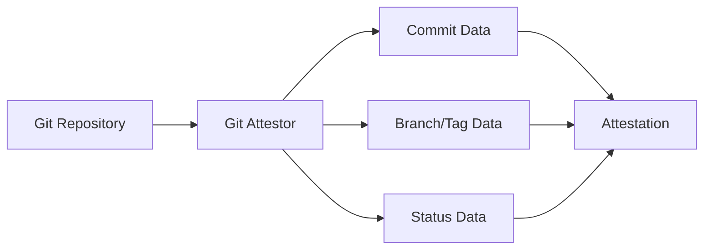

# Rich Documentation Patterns for Attestors

## The Challenge

Struct tags are great for field-level documentation, but we need more:
- Detailed explanations of what the attestor does
- Multiple usage examples with context
- Integration guides
- Troubleshooting information
- Architecture diagrams
- Best practices

## Solution 1: Embedded Markdown Files (Recommended)

### In go-witness:

```go
// go-witness/attestation/git/git.go
package git

import _ "embed"

//go:embed docs/overview.md
var DocOverview string

//go:embed docs/examples.md
var DocExamples string

//go:embed docs/security.md
var DocSecurity string

//go:embed docs/troubleshooting.md
var DocTroubleshooting string

// Or embed entire directory
//go:embed docs/*
var docsFS embed.FS

type Attestor struct {
    CommitHash string `json:"commithash" jsonschema:"title=Commit Hash,description=SHA hash of the current HEAD commit"`
    // ... other fields with jsonschema tags
}

// Documentation method returns structured rich documentation
func (a *Attestor) Documentation() map[string]string {
    return map[string]string{
        "overview":        DocOverview,
        "examples":        DocExamples,
        "security":        DocSecurity,
        "troubleshooting": DocTroubleshooting,
    }
}
```

### Directory structure in go-witness:
```
attestation/
  git/
    git.go
    git_test.go
    docs/
      overview.md
      examples.md
      security.md
      troubleshooting.md
      diagrams/
        git-flow.svg
```

### Example docs/overview.md:
```markdown
# Git Attestor Overview

The Git attestor provides comprehensive capture of Git repository state at the time of build, establishing an immutable link between your artifacts and their source code.

## How It Works

The Git attestor examines your repository and records:

1. **Commit Information**
   - Current HEAD commit hash
   - Author and committer details
   - Commit message and timestamp
   - GPG signature status

2. **Repository State**
   - Working directory status (clean/dirty)
   - Staged and unstaged changes
   - Untracked files

3. **Branch and Tag Information**
   - Current branch
   - All branches containing the commit
   - Associated tags

## Architecture



## Use Cases

### Supply Chain Security
Establish cryptographic proof that artifacts were built from specific, reviewed code...

### Compliance and Audit
Meet regulatory requirements by maintaining immutable records...
```

## Solution 2: Documentation Interface with Rich Types

### In go-witness:

```go
// go-witness/attestation/attestor.go
type Documenter interface {
    Documentation() Documentation
}

type Documentation struct {
    Name        string
    Summary     string
    Description string
    
    UseCases    []UseCase
    Examples    []Example
    
    Architecture *Architecture
    Security     SecurityConsiderations
    
    Troubleshooting []TroubleshootingItem
    BestPractices   []string
    
    RelatedLinks []Link
}

type UseCase struct {
    Title       string
    Description string
    Scenario    string
    Benefits    []string
}

type Example struct {
    Title       string
    Description string
    
    // Multiple command variations
    Commands    []CommandExample
    
    // Expected output
    Output      string
    
    // Explanation of what happens
    Explanation string
}

type CommandExample struct {
    Platform    string // "linux", "macos", "windows", "all"
    Command     string
    Notes       string
}

type Architecture struct {
    Description string
    Diagram     string // Mermaid or SVG
    Components  []Component
}

type SecurityConsiderations struct {
    Overview string
    Risks    []SecurityRisk
    Mitigations []string
}
```

### Implementation:

```go
// go-witness/attestation/git/documentation.go
package git

import _ "embed"

//go:embed docs/architecture.mermaid
var architectureDiagram string

func (a *Attestor) Documentation() attestation.Documentation {
    return attestation.Documentation{
        Name:    "Git",
        Summary: "Captures comprehensive Git repository state",
        Description: `
The Git attestor provides a complete snapshot of your Git repository state at 
build time, creating an immutable link between your artifacts and their exact 
source code. This includes not just the commit hash, but also branch information,
tags, signatures, and working directory status.`,

        UseCases: []attestation.UseCase{
            {
                Title: "Supply Chain Security",
                Description: "Establish cryptographic proof of source code provenance",
                Scenario: `A security team needs to verify that production artifacts 
were built from reviewed and approved source code. The Git attestor provides
immutable evidence linking artifacts to specific commits.`,
                Benefits: []string{
                    "Cryptographic link between artifacts and source",
                    "Detection of unauthorized code changes",
                    "Audit trail for compliance",
                },
            },
            {
                Title: "Reproducible Builds",
                Description: "Ensure builds can be reproduced from exact source state",
                Scenario: `A team needs to rebuild a year-old release for a critical
patch. The Git attestor's complete state capture ensures they can recreate
the exact build environment.`,
                Benefits: []string{
                    "Complete source state preservation",
                    "Detection of uncommitted changes",
                    "Historical build reproduction",
                },
            },
        },

        Examples: []attestation.Example{
            {
                Title: "Basic Git Attestation",
                Description: "Capture Git state during a standard build",
                Commands: []attestation.CommandExample{
                    {
                        Platform: "all",
                        Command:  "witness run -a git -s build -- make build",
                        Notes:    "Captures Git state before running make",
                    },
                },
                Output: `{
    "type": "https://witness.io/attestations/git/v0.1",
    "attestation": {
        "commithash": "d3adb33f42e5eb1b5c3a1f8b0c2a6d9f8e3a5b7c",
        "branch": "main",
        "status": "clean",
        ...
    }
}`,
                Explanation: `This attestation shows a clean repository state on the main
branch. The commit hash can be used to verify the exact source code used.`,
            },
        },

        Architecture: &attestation.Architecture{
            Description: "How the Git attestor interacts with your repository",
            Diagram:     architectureDiagram,
            Components: []attestation.Component{
                {
                    Name: "Repository Scanner",
                    Role: "Reads Git objects and working directory state",
                },
                {
                    Name: "Signature Verifier", 
                    Role: "Validates GPG signatures on commits",
                },
            },
        },

        Security: attestation.SecurityConsiderations{
            Overview: `The Git attestor may capture sensitive information from your 
repository. Understanding these risks helps you configure it appropriately.`,
            Risks: []attestation.SecurityRisk{
                {
                    Risk: "Repository URLs may contain access tokens",
                    Impact: "High",
                    Mitigation: "Use SSH URLs or credential helpers instead of embedded tokens",
                },
                {
                    Risk: "Commit messages might contain sensitive data",
                    Impact: "Medium", 
                    Mitigation: "Review commit message standards, use conventional commits",
                },
            },
        },

        Troubleshooting: []attestation.TroubleshootingItem{
            {
                Problem: "Git attestor fails with 'not a git repository'",
                Cause:   "Running witness outside a Git repository",
                Solution: "Ensure you run witness from within a Git repository, or use --attestor-git-repo-dir to specify the repository path",
            },
        },

        BestPractices: []string{
            "Always run from a clean repository state for production builds",
            "Use signed commits for additional verification",
            "Configure .gitignore properly to avoid capturing sensitive files",
            "Use SSH or token-less HTTPS URLs for remotes",
        },

        RelatedLinks: []attestation.Link{
            {Title: "Git Documentation", URL: "https://git-scm.com/doc"},
            {Title: "Witness Git Tutorial", URL: "https://witness.io/tutorials/git"},
        },
    }
}
```

## Solution 3: Documentation Generation with Markers

### In go-witness:

```go
// +witness:doc section="overview"
// +witness:doc # Git Attestor Deep Dive
// +witness:doc 
// +witness:doc The Git attestor is one of the most fundamental attestors in Witness,
// +witness:doc providing comprehensive source code provenance. Unlike simple commit
// +witness:doc tracking, it captures the complete repository state including:
// +witness:doc 
// +witness:doc - Working directory status
// +witness:doc - Branch relationships  
// +witness:doc - Tag associations
// +witness:doc - Signature verification
// +witness:doc end
type Attestor struct {
    // +witness:field rich="true"
    // +witness:field:description
    // The commit hash uniquely identifies the source code state. This is the
    // SHA-1 (or SHA-256 in newer Git versions) hash of the commit object.
    // 
    // ## Verification
    // You can verify this matches your repository:
    // ```bash
    // git rev-parse HEAD
    // ```
    // +witness:field:end
    CommitHash string `json:"commithash" jsonschema:"title=Commit Hash"`
}
```

## Solution 4: External Documentation with Sync

### In go-witness:
```go
// Reference to external documentation
const DocURL = "https://docs.witness.io/attestors/git"

// Or reference to docs in witness repo
const DocPath = "docs/attestors/git-detailed.md"
```

### In witness repo:
Create rich documentation separately but with tooling to verify it stays in sync:

```yaml
# docs/attestors/git/metadata.yaml
source: github.com/in-toto/go-witness/attestation/git
version: v0.1.0
fields:
  - name: commithash
    type: string
    source_line: 42
  - name: committer
    type: object
    source_line: 44
```

## Recommendation: Hybrid Approach

1. **Struct tags** for field-level documentation (already shown)
2. **Embedded markdown** for rich narrative documentation
3. **Documentation interface** for structured access
4. **Generated reference** from the above

This gives you:
- Rich, maintainable documentation in go-witness
- Automatic extraction in witness CLI
- Type safety and structure
- Flexibility for complex documentation needs

The embedded markdown approach is particularly nice because:
- Markdown files can be edited with proper tooling
- They're versioned with the code
- They can include diagrams, complex formatting
- They're readable in the go-witness repo directly
- The embed directive makes them part of the binary